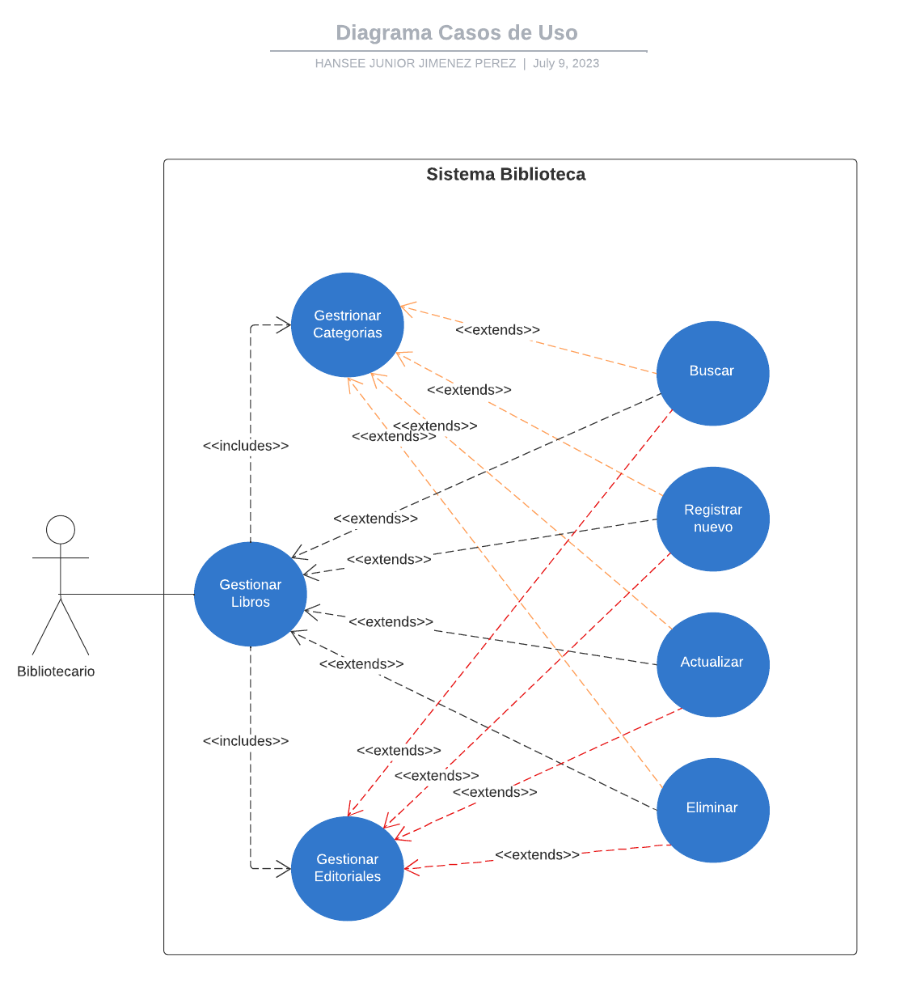
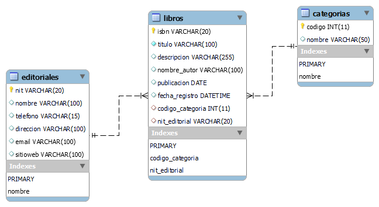

# Proyecto Codificacion Actividad Biblioteca

La presente actividad consiste en el desarrollo de un modulo para la gestion de libros de una Biblioteca empleando las siguientes tecnologias:

- Java 11
- Hibernate
- MySQL

El desarrollo del programa se realizo para su utilizacion mediante consola.

## Documentacion

El proyecto consiste en el desarrollo de un modulo que permita realizar operaciones de busqueda, creacion, actualizacion y eliminacion de Libros en una biblioteca.

### Diagrama de Casos de Uso

Se presenta el componente visual de la necesidad del negocio:

### Diagrama Modelo Relacional

Se presenta la estructura de la Base de Datos y la informacion para almacenar:

## Historias de Usuario

A partir de lo que se requiere desarrollar se crean las siguientes Historias de Usuario:

### Gestionar Libros

**Como** Bibliotecario

**Quiero** poder gestionar la informacion de los libros que se adquieran y los existentes en la biblioteca

**Para** mantener actualizado el inventario de libros

#### Criterios de Aceptacion

- Se debe poder buscar cualquier libro que exista en la biblioteca a partir de su ISBN.

- Se debe poder realizar el registro de un nuevo libro (que no exista en la biblioteca) al menos con los datos obligatorios como: ISBN, Codigo de Categoria del libro y NIT de la Editorial del libro.

- Se debe poder actualizar la informacion de un libro ya registrado teniendo en cuenta unicamente los datos que se requieren cambiar.

- Se debe poder eliminar un libro segun su ISBN del inventario de libros.

### Gestionar Categorias

**Como** Bibliotecario

**Quiero** poder gestionar las categorias que pueden tener los libros

**Para** poder clasificar correctamente a que genero pertenece cada libro

#### Criterios de Aceptacion

- Se debe poder buscar cualquier categoria existente mediante su Codigo.

- Se debe poder realizar el registro de una nueva categoria (que no exista previamente) colocando unicamente el nombre de la categoria.

- Se debe poder actualizar el nombre de la categoria.

- Se debe poder eliminar una categoria mediante su Codigo siempre y cuando no exista ningun libro que pertenezca a dicha categoria.

### Gestionar Editoriales

**Como** Bibliotecario

**Quiero** poder gestionar las editoriales a los que pueden pertencer los libros

**Para** poder clasificar correctamente los libros segun la editorial que provienen

#### Criterios de Aceptacion

- Se debe poder buscar cualquier editorial existente mediante su NIT.

- Se debe poder realizar el registro de una nueva editorial (que no exista previamente) colocando unicamente el NIT de la editorial y el nombre de la editorial.

- Se debe poder actualizar la informacion de una editorial ya registrada teniendo en cuenta unicamente los datos que se requieren modificar.

- Se debe poder eliminar una editorial segun su NIT siempre y cuando no exista ningun libro que pertenezca a dicha editorial.